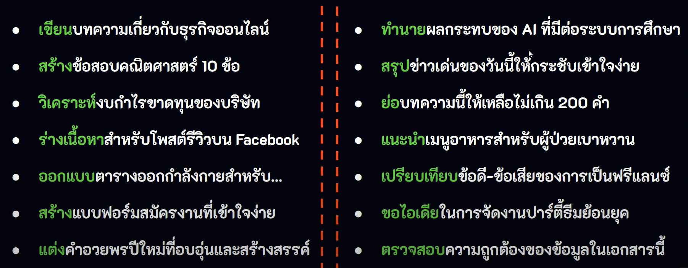
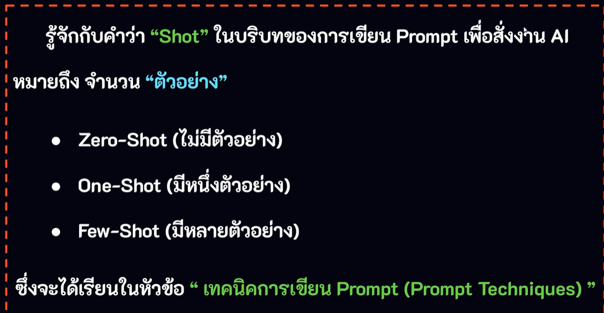

| Task / Instruction                                                                                                                                                                                                                     | Context                                                                                                                                                                             | Examples                                                                                                                                                                                                                                                                        | Persona                                                                                                                                                                                                                                                                       | Format/Style                                                                                                                                                                                                                                                                                                                                   | Tone                                                                                                                                                                                                       |
| -------------------------------------------------------------------------------------------------------------------------------------------------------------------------------------------------------------------------------------- | ----------------------------------------------------------------------------------------------------------------------------------------------------------------------------------- | ------------------------------------------------------------------------------------------------------------------------------------------------------------------------------------------------------------------------------------------------------------------------------- | ----------------------------------------------------------------------------------------------------------------------------------------------------------------------------------------------------------------------------------------------------------------------------- | ---------------------------------------------------------------------------------------------------------------------------------------------------------------------------------------------------------------------------------------------------------------------------------------------------------------------------------------------- | ---------------------------------------------------------------------------------------------------------------------------------------------------------------------------------------------------------- |
| กำหนดเป้าหมาย (ความต้องการ)                                                                                                                                                                                                            | ระบุรายละเอียดที่เกี่ยวข้อง                                                                                                                                                         | ตัวอย่างประกอบ                                                                                                                                                                                                                                                                  | บทบาท ตัวตน หรือ บุคลิก                                                                                                                                                                                                                                                       | รูปแบบหรือแนวทางของผลลัพธ์                                                                                                                                                                                                                                                                                                                     | อารมณ์ น้ำเสียง หรือ บรรยากาศ                                                                                                                                                                              |
| หัวใจสำคัญของ Prompt คือ การเขียนคำสั่งเพื่อกำหนด “สิ่งที่ต้องการให้ AI ทำ” โดยต้องระบุคำสั่งอย่างชัดเจนและตรงไปตรงมา ใช้ภาษาที่กระชับและเข้าใจง่าย หากคำสั่งไม่ชัดเจน AI อาจตีความผิดพลาดหรือให้คำตอบที่ไม่ตรงกับความต้องการของเราได้ | การกำหนดบริบท คือ การให้รายละเอียดข้อมูลเพิ่มเติมว่าตอนนี้ “กำลังคุยเรื่องอะไร” ซึ่งจะช่วยให้ AI เข้าใจสถานการณ์หรือเงื่อนไข ที่ต้องนำไปใช้เพื่อตอบคำถามหรือให้ผลลัพธ์ได้แม่นยำขึ้น | การเขียน Prompt ที่มีการนำ "ตัวอย่าง” หรือ “แม่แบบ” มาใช้งานนั้นจะช่วย ให้ AI เข้าใจเกี่ยวกับสิ่งที่เราต้องการให้ทำได้ชัดเจนยิ่งขึ้น โดยเราสามารถใช้ตัวอย่างเพื่อระบุลักษณะของผลลัพธ์ที่เราต้องการได้ เช่น การเขียนในสไตล์ของบุคคลใดบุคคลหนึ่งหรือให้ข้อมูลที่มีโครงสร้างชัดเจน | คือ การกำหนดให้ AI นั้นมีบุคลิกหรือรับบทบาทเป็น... เพื่อช่วยแก้ปัญหา และตอบคำถามตามบทบาทที่ได้รับ เช่น นักวิทยาศาสตร์ นักจิตวิทยา นักเขียน อาจารย์ หรือผู้เชี่ยวชาญในสาขาต่างๆ ซึ่งจะช่วยให้คำตอบนั้นมีมุมมองเฉพาะ (ใช้ร่วมกับ Context เพื่อให้ได้คำตอบที่ลึกซึ้งมากยิ่งขึ้น) | คือ การกำหนดรูปแบบ (Format) หรือสไตล์ (Style) เพื่อเป็นแนวทางให้ AI. แสดงผลลัพธ์ตามที่เราต้องการ เช่น แสดงผลรูปแบบ ตาราง กราฟ หัวข้อย่อย ย่อหน้า บทความพร้อมกำหนดความยาวของเนื้อหา รูปภาพ วิดีโอ โค้ดโปรแกรม เป็นต้น. การจัดรูปแบบจะช่วยให้ผลลัพธ์ที่ได้ มีโครงสร้างชัดเจน กระชับและมีความ เป็นระเบียบมากขึ้น (ใช้ร่วมกับ Context และ Persona) | คือการกำหนดอารมณ์ ความรู้สึก หรือบรรยากาศของคำตอบ. ซึ่งจะช่วยให้คำตอบนั้นมีเอกลักษณ์ สอดคล้องกับความต้องการ. ของกลุ่มเป้าหมายหรือบริบทของผู้ฟัง/ผู้อ่าน. (ใช้ร่วมกับ Persona เพื่อให้ผลลัพธ์ดูน่าเชื่อถือ) |
| Write, Prepare, Draft, Debug, Generate, Explain, Expand, List, Answer, Analyze, Criticize, Compare, Design, Make                                                                                                                       | -                                                                                                                                                                                   | -                                                                                                                                                                                                                                                                               | -                                                                                                                                                                                                                                                                             | -                                                                                                                                                                                                                                                                                                                                              | -                                                                                                                                                                                                          |
| Brainstorm, Suggest, Predict, Rewrite, Refine, Rephrase, Summarize, Outline, Translate, Act as                                                                                                                                         | -                                                                                                                                                                                   | -                                                                                                                                                                                                                                                                               | -                                                                                                                                                                                                                                                                             | -                                                                                                                                                                                                                                                                                                                                              | -                                                                                                                                                                                                          |

## องค์ประกอบพื้นฐานของ

องค์ประกอบพื้นฐานของ Prompt [https://github.com/kongruksiamza/prompt-elements](https://github.com/kongruksiamza/prompt-elements)

### Task / Instruction Example

### Context Example

### Task and Context Example

### Example

### Persona Example

## เทคนิคการเขียน Prompt (Techniques)

Link [https://github.com/kongruksiamza/prompts-techniques](https://github.com/kongruksiamza/prompts-techniques)

### Zero-Shot Prompting

    เป็นเทคนิคในการป้อนคำสั่ง (Prompt) ให้ AI ทำงานโดย “ไม่มีตัวอย่าง ” หรือไม่ให้แนวทางใดๆก่อน (ไม่ได้ฝึกสอน)
    AI จะต้องใช้ความรู้ที่มีอยู่ในการเข้าใจคำถามและคาดเดาว่าผู้ใช้ต้องการ อะไรจากนั้นจะสร้างคำตอบให้ตรงกับความต้องการของผู้ใช้ให้ได้มากที่สุด

### One-Shot Prompting

    เป็นเทคนิคในการป้อนคำสั่ง (Prompt) ให้ AI ทำงานโดยระบุตัวอย่างเพียง
    “หนึ่งตัวอย่าง” หรือ “หนึ่งคำถาม” เพื่อเป็นแนวทางให้ AI เข้าใจและสร้าง ผลลัพธ์ในลักษณะเดียวกัน
    เทคนิคนี้จะช่วยประหยัดเวลาในการอธิบายรายละเอียด อีกทั้งยังช่วย ลดความคลาดเคลื่อนของผลลัพธ์ ทำให้ได้ผลลัพธ์ที่มีรูปแบบที่ชัดเจนมากยิ่งขึ้น

### Few-Shot Prompting

    เป็นเทคนิคในการเขียน Prompt โดยระบุตัวอย่างมากกว่า 1 ตัวอย่าง เพื่อเป็นแนวทางให้ AI เข้าใจรูปแบบและสามารถทำงานในลักษณะเดียวกันได้
    เทคนิคนี้จะใช้ในกรณีที่ AI ไม่ได้ถูกฝึกฝนให้ทำงานเฉพาะทาง แต่เรา สามารถช่วยให้ AI นั้นเข้าใจบริบทได้ดีขึ้นจากการให้หลายๆตัวอย่างที่ชัดเจน เหมาะสำหรับงานที่ต้องการความแม่นยำสูง

### Chain-of-Thought Prompting (CoT)

    เป็นเทคนิคการเขียน Prompt ที่ช่วยให้ AI สามารถให้คำตอบที่มีเหตุผลและ ถูกต้องมากยิ่งขึ้น โดยการกระตุ้นให้อธิบายถึงกระบวนการคิดทีละขั้นตอนในการ แก้ไขปัญหาต่างๆโดยเฉพาะปัญหาที่ต้องใช้การคิดเชิงตรรกะ การวิเคราะห์ และการวางแผน
    หลักการคล้ายๆกับเวลาที่มนุษย์แก้ไขปัญหาที่ซับซ้อน เช่น คณิตศาสตร์ การให้เหตุผลเชิงตรรกะหรือการวางแผนและการตัดสินใจในเรื่องต่างๆ เป็นต้น

### Role-Play Prompting

### Counterfactual Prompting
