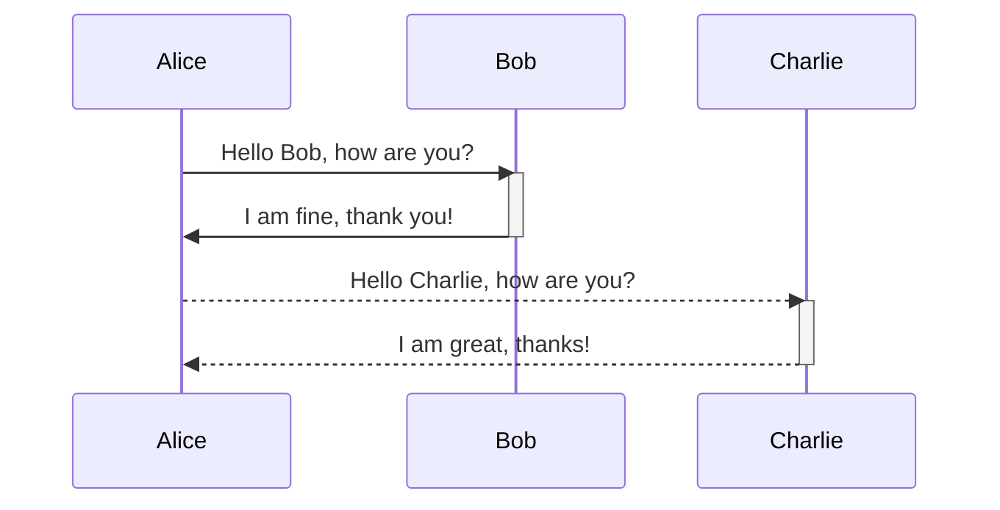
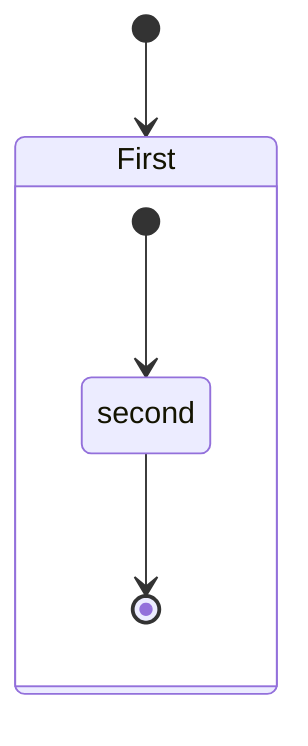

# Report

## Income

| Monthly Income      | NonMonthly Income | |
| ------------- | ----------- |-|
| Amount        | Amount      | |
| Accumulate    |             | |
| Total         |             | |
| From Date     |             | |
| To Date       |             | |
| Type          | Type        | (Salary, OT, Commission, Bonuses, Tips...)|
| Status        | Status      | (Active, Update, Pending, Cancel, Done)| 
| Issue Date    | Issue Date  | |

## Outcome
|Monthly OutCome  |
|-------------|
|Amount       |
|Accumulate   |
|Total        |
|From Date    |
|To Date      |
|Type         |
|Status       |
|Issue Date   |

## Diagram

- Markdown Preview Mermaid Support




# User

```bash
FIRST_SUPERUSER=admin@example.com
```

```bash
FIRST_SUPERUSER_PASSWORD=I536ib9E6HVxgc
```

```console
$ uvicorn backend.app.main:app --reload
```
