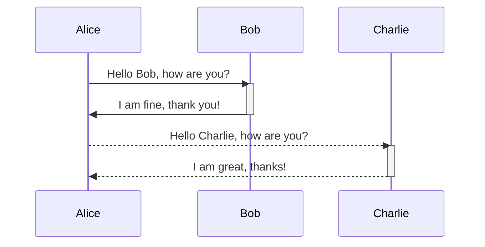

# Report

## Get list of Staff

Show overview information about staff, include:

- Department
- Staff ID
- Status
- Name
- Gender
- Position
- Bank Account
- Birthday
- Hire date
- Debt
- Welfare
- Salary
- Reduction
- Total salary

Function Menu:

- Add new staff
- Update staff information
- Delete staff
- Search staff by ID or name
- Sort staff by department, position and status
- Export to CSV file
- Import from CSV file
- Selection of staff status, department, position and gender

## Department Info

- Get list of departments id, set name as common_list and current_list.
- Check Parent_ID from common_list, remove that id from current_list.

1. Get Parent_IDs from current_list, add that IDs into next_list.
2.

## Diagram

