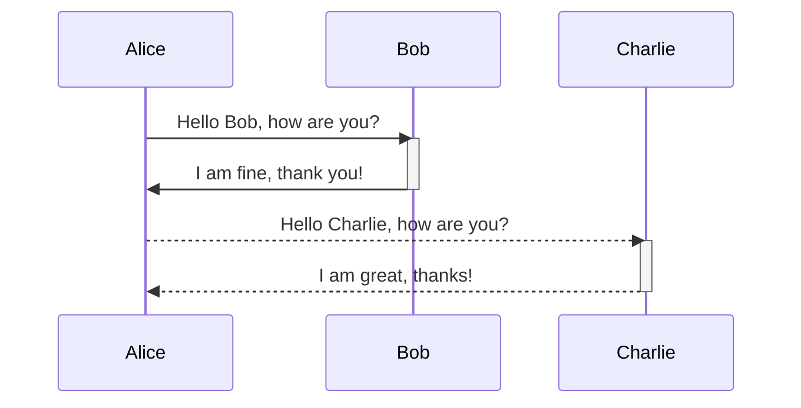
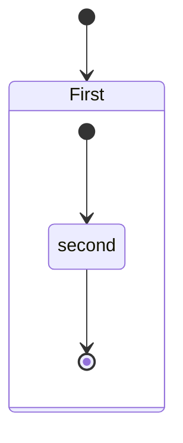

# Tables

## Income & Outcome

| (Monthly Income) | (NonMonthly Income) | (Monthly OutCome) |
| ---------------- | ------------------- | ----------------- |
| Amount           | Amount              | Amount            |
| Type             | Type                | Type              |
| Status           | Status              | Status            |
| Issue Date       | Issue Date          | Issue Date        |
| From Date        | -                   | From Date         |
| To Date          | -                   | To Date           |
| Accumulate       | -                   | Accumulate        |
| Total            | -                   | Total             |

### Type and Status of Income / Outcome

| (Type NonMonthly) | (Status) | (Type Monthly) |
| ----------------- | -------- | -------------- |
| OT                | Active   | Salary         |
| Commission        | Update   | Position       |
| Bonuses           | Pending  | Gasoline       |
| Tips              | Cancel   | -              |
| Allowances        | Done     | -              |
| Severance Pay     | Initial  | -              |
| Profit Sharing    | -        | -              |

## Slip

| Item                    |
| ----------------------- |
| Employee ID             |
| List Incomes / Outcomes |
| Amount                  |
| Month                   |

## Diagram

- Markdown Preview Mermaid Support





# User

```bash
FIRST_SUPERUSER=admin@example.com
```

```bash
FIRST_SUPERUSER_PASSWORD=I536ib9E6HVxgc
```

```console
$ uvicorn backend.app.main:app --reload
```
