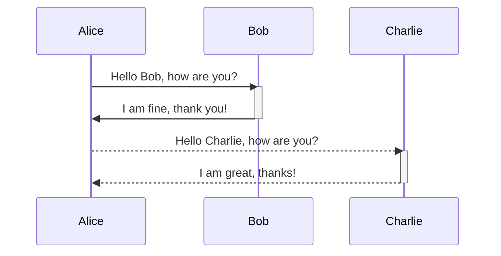

# Report

## Department Info

- Get list of Department, tree structure, JSON format.
- Each node of tree include descendants id.

## Diagram



# User

```bash
FIRST_SUPERUSER=admin@example.com
```

```bash
FIRST_SUPERUSER_PASSWORD=I536ib9E6HVxgc
```

```console
$ uvicorn backend.app.main:app --reload
```
